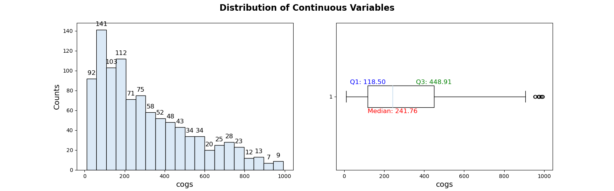

# Partially Automated Exploratory Data Analysis

Exploratory Data Analysis provides sense of the data and often sets the initial roadmap for our data analysis. Often Data scientists spends maximum time in Exploratory Data analysis so it would be worthwhile to automate some tasks for performing EDA.

After we have perfomed data cleaning such as checking data types, missing values, duplicated values check etc., we can perform data visualization to get some more insights. This can be in following steps.
* Univariate Data analysis
    * Categorical Variables
    * Continuous Variables
* Bivariate Data analysis
    * Categorical Variables vs. Categorical Variables
    * Continuous Variables vs. Continuous Variables
* Multivariate analysis
    * Categorical Variables vs. Continuous Variables

## Dataset
 We will work with a superstore sales dataset. It has 1000 columns and about 17 features. Two more features were added 'day' and 'TimeoftheDay'.Below is the link to the dataset.

 [SuperStore Sales Dataset](https://www.kaggle.com/datasets/aungpyaeap/supermarket-sales) 

## Description

<table>
<tr>
    <th>#</th>
    <th>Variable</th>
    <th>Description</th>
    <th>Data type</th>
</tr>
<tr>
    <td>1</td>
    <td>Invoice id</td>
    <td>Computer generated sales slip invoice identification number</td>
    <td>object</td>
</tr>
<tr>
    <td>2</td>
    <td>Branch</td>
    <td> Branch of supercenter (3 branches are available identified by A, B and C)</td>
    <td>object</td>
</tr>
<tr>
    <td>3</td>
    <td>City</td>
    <td>Location of supercenters</td>
    <td>object</td>
</tr>
<tr>
    <td>4</td>
    <td>Customer type</td>
    <td>Type of customers, recorded by Members for customers using member card and Normal for       without member card</td>
    <td>object</td>
</tr>
<tr>
    <td>5</td>
    <td>Gender</td>
    <td>Gender type of customer</td>
    <td>object</td>
</tr>
<tr>
    <td>6</td>
    <td>Product line</td>
    <td>General item categorization groups - Electronic accessories, Fashion accessories, Food and beverages, Health and beauty, Home and lifestyle, Sports and travel</td>
    <td>object</td>
</tr>
<tr>
    <td>7</td>
    <td>Unit price</td>
    <td>Price of each product in dollar</td>
    <td>float64</td>
</tr>
<tr>
    <td>8</td>
    <td>Quantity</td>
    <td>Number of products purchased by customer</td>
    <td>int64</td>
</tr>
<tr>
    <td>9</td>
    <td>Tax 5% </td>
    <td>5% tax fee for customer buying</td>
    <td>float64</td>
</tr>
<tr>
    <td>10</td>
    <td>Total</td>
    <td>Total price including tax</td>
    <td>float64</td>
</tr>
<tr>
    <td>11</td>
    <td>Date</td>
    <td> Date of purchase (Record available from January 2019 to March 2019)</td>
    <td>object</td>
</tr>
<tr>
    <td>12</td>
    <td>Time</td>
    <td>Purchase time (10am to 9pm)</td>
    <td>object</td>
</tr>
<tr>
    <td>13</td>
    <td>Payment</td>
    <td>Payment used by customer for purchase (3 methods are available – Cash, Credit card and Ewallet)</td>
    <td>object</td>
</tr>
<tr>
    <td>14</td>
    <td>cogs</td>
    <td>Cost of goods sold</td>
    <td>float64</td>
</tr>
<tr>
    <td>15</td>
    <td>gross margin percentage</td>
    <td>Gross margin percentage</td>
    <td>float64</td>
</tr>
<tr>
    <td>16</td>
    <td>gross income</td>
    <td>Gross income</td>
    <td>float64</td>
</tr>
<tr>
    <td>17</td>
    <td>Rating</td>
    <td>Customer stratification rating on their overall shopping experience (On a scale of 1 to 10)</td>
    <td>float64</td>
</tr> 
</table>


## Categorical Variables

The code below will plot pie chart and count plot for each categorical variables. Please remove manually any categorical variables that has more than 15 categories. We can use Pivot table that will be easier to interprete. In this example, we removed 'Invoice ID' and 'Time' variables.

So, this will store all the categorical varriables of the dataframe in a variable and run a loop to display sub plots of pie chart and count plots side by side for each category.

```python
''' Categorical Variables '''

palette = sns.color_palette('Accent', 8)

# Iterate over categorical columns to plot
def plot_chart(col):
    fig, ax = plt.subplots(1, 2, figsize=(20, 5))

    # Pie chart
    counts = df[col].value_counts()
    wedges, texts, autotexts = ax[0].pie(
        counts,
        labels=counts.index,
        autopct='%1.1f%%',
        textprops={'fontsize': 18, 'fontfamily': 'serif'},
        shadow=False,
        wedgeprops={'edgecolor': 'black', 'lw': 1.5},
        colors=palette
    )
    for autotext in autotexts:
        autotext.set_color('white')
        autotext.set_weight('bold')
        autotext.set_size(14)
    
    ax[0].set_title(f'{col} - Pie Chart', fontweight='bold', fontfamily='serif')          

    # Count plot
    sns.countplot(x=col, data=df, ax=ax[1], palette=palette, edgecolor='black', lw=1.5, order=counts.index)
    ax[1].set_title(f'{col} - Count Plot', fontweight='bold', fontfamily='serif')
    ax[1].set_xlabel('')
    ax[1].set_ylabel('')
    ax[1].set_xticklabels(ax[1].get_xticklabels(), fontfamily='serif', fontsize=12,rotation=45)
    
    # Annotate count plot
    for p in ax[1].patches:
        height = p.get_height()
        ax[1].annotate(f'{int(height)}', (p.get_x() + p.get_width() / 2, height),
                       ha='center', va='bottom', fontsize=14, fontweight='bold')
    plt.savefig(f'img/Categorical/{col}.png')
    plt.tight_layout()
    plt.show()
    
# Use interact to create an interactive widget
interact(plot_chart, col=widgets.Dropdown(options=categorical, description='Category:'))
```


## Continuous Variables

In the similar way, we can display histograms and box plots for the all the continuous variables using the code below.
 
```python
''' Continuous Variables '''
numerical = df.select_dtypes(include = 'number').columns
def plot_distribution(column):
    fig, (ax1, ax2) = plt.subplots(1, 2, figsize=(16, 5))
    fig.suptitle("Distribution of Continuous Variables", fontsize=16, fontweight='bold')

    # Histogram
    counts, bins, patches = ax1.hist(df[column].dropna(), bins=20, edgecolor='black')
    ax1.set_xlabel(column, fontsize=14)
    ax1.set_ylabel("Counts", fontsize=14)

    # Adding data labels to histogram bars
    for count, patch in zip(counts, patches):
        height = patch.get_height()
        ax1.annotate(f'{int(count)}', xy=(patch.get_x() + patch.get_width() / 2, height),
                     xytext=(0, 5), textcoords='offset points', ha='center', va='bottom', fontsize=12)

    # Boxplot
    ax2.boxplot(df[column].dropna(), vert=False)
    ax2.set_xlabel(column, fontsize=14)
    ax2.set_ylabel("", fontsize=14)

    # Adding median and quartile values to the box plot
    median = np.median(df[column].dropna())
    q1 = np.percentile(df[column].dropna(), 25)
    q3 = np.percentile(df[column].dropna(), 75)

    ax2.annotate(f'Median: {median:.2f}', xy=(median, 1), xytext=(0, -28), 
                 textcoords='offset points', ha='center', va='center', color='red', fontsize=12)
    ax2.annotate(f'Q1: {q1:.2f}', xy=(q1, 1), xytext=(0, 27), 
                 textcoords='offset points', ha='center', va='center', color='blue', fontsize=12)
    ax2.annotate(f'Q3: {q3:.2f}', xy=(q3, 1), xytext=(0, 27), 
                 textcoords='offset points', ha='center', va='center', color='green', fontsize=12)

    plt.savefig(f'img/Numerical/{column}.png')
    plt.tight_layout()
    plt.show()

# Create an interactive widget
interact(plot_distribution, column=widgets.Dropdown(options=numerical, description='Numeric:'))
```



## Bivariate analysis

### Categorical Variables vs. Categorical Variables

The code below will extract all the categorical variables and display countplots for different combination of the categorical variables.

```python
''' Categorical Variables vs. Categorical Variables '''
# get all categorical variables
categorical_columns=[]
categorical_columns= df1.select_dtypes(include = 'object').columns

def plot_categorical_combinations(col1, col2):
    if col1 == col2:
        print("Please select two different columns.")
        return
    
    fig, ax = plt.subplots(figsize=(12, 5))
    
    # Create count plot
    plot = sns.countplot(data=df, x=col1, hue=col2, ax=ax)
    ax.set_title(f'{col1} vs {col2}', fontsize=14, fontweight='bold')
    ax.set_xticklabels(ax.get_xticklabels(), rotation=45, fontsize=12)
    ax.legend(title=col2, bbox_to_anchor=(1, 1), loc='upper left', fontsize=12)
    
    # Add count labels
    for p in plot.patches:
        height = p.get_height()
        plot.annotate(f'{height}', 
                      (p.get_x() + p.get_width() / 2., height), 
                      ha='center', va='baseline', 
                      fontsize=10, color='black', 
                      xytext=(0, 5), 
                      textcoords='offset points')
        
        
    plt.savefig(f'img/CategoricalVsCategorical/{col1}vs{col2}.png')
    plt.tight_layout()
    plt.show()

# Create interactive widget
interact(
    plot_categorical_combinations,
    col1=widgets.Dropdown(options=categorical_columns, description='Category 1:'),
    col2=widgets.Dropdown(options=categorical_columns, description='Category 2:')
)

```

### Continuous Variables vs. Continuous Variables

For visualizing different combination of the continous variables pairplots and coorelation matrix can be used.

```python
''' Pairplots '''
df_continuous= df.select_dtypes(include=[np.number])
sns.pairplot(df_continuous, height=2.0)

''' Correlation Matrix '''
sns.heatmap(df_continuous.corr(),cmap='coolwarm', annot=True)
```

## Multivariate analysis

### Continuous Variables vs. Categorical Variables

The above analysis will provide us with some insights and we may be further interested to investigate relationship between different categorical and continuous variable. We can use pivot tables and plot bar graphs to visualize it. For our dataset, we are want which days<sup>1</sup> and time of the day<sup>2</sup>, SuperStore makes the highest sales. Also, we want to know this for each location. The code below will create pivot tables and display horizontal bar graphs for each city.

Please note 'Day' and 'TimeoftheDay' were created from the 'Date' and 'Time' variables respectively.

```python
''' Pivot tables  '''
# List of cities
cities = df['City'].unique().tolist()

sns.set_palette('Accent')
sns.set_style("darkgrid")

def plot_gross_income_by_time_and_day(city):
    df1 = df[df["City"] == city]
    
    df_pivot1 = pd.pivot_table(
        df1, 
        values="gross income", 
        index="Day",
        columns=["TimeoftheDay"],
        aggfunc=np.sum,
        fill_value=0
    )
    
    # Convert values to percentages
    df_pivot1_percentage = df_pivot1.div(df_pivot1.sum(axis=1), axis=0) * 100
    
    fig, ax = plt.subplots(figsize=(20, 6))
    
    # Plot horizontal bar chart
    pivot = df_pivot1_percentage
    pivot.plot(kind='barh', stacked=True, width=0.7, ax=ax, cmap='Accent')
    
    ax.set_ylabel("Day", fontsize=16)
    ax.set_xlabel("Gross income %", fontsize=16)
    ax.set_title(f"Gross income by time and day for {city}", fontsize=23)
    
    # Adjust axis labels
    ax.set_xticklabels(ax.get_xticklabels(), fontsize=19, rotation=0)
    ax.set_yticklabels(ax.get_yticklabels(), fontsize=19, rotation=0)
    
    # Adjust legend
    legend = ax.legend(title='Time', fontsize=16, title_fontsize=18, loc='upper right')
    
    # Adding percentage labels
    for container in ax.containers:
        labels = [f'{v:.1f}%' if v > 0 else '' for v in container.datavalues]
        ax.bar_label(container, labels=labels, label_type='center', fontsize=16, color='white')
   
    plt.savefig(f'img/CityDayTime/{city}.png')
    plt.tight_layout()
    plt.show()

# Create interactive widget
interact(
    plot_gross_income_by_time_and_day,
    city=widgets.Dropdown(options=cities, description='City:')
)
```


Also, ydata_profiling package can be used  exploratory data analysis.

```python
import pandas as pd
from ydata_profiling import ProfileReport

# Generate the report
profile = ProfileReport(df1,title="SuperStore Sales EDA Report")

# Save the report to .html
profile.to_file("Exploratory Data Analysis.html")
```


[def]: img/contvscont.png